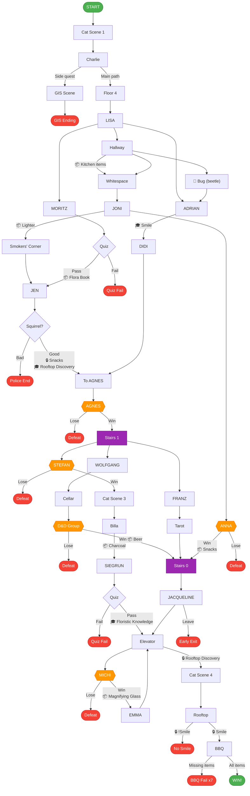

# Game Flow - Simplified

## Legend

📦 = Item | 🎓 = Skill | 🔒 = Requires

## BBQ Requirements

**Items:** Flora Book, Charcoal, Lighter, Beer, Magnifying Glass

**Skills:** Smile, Floristic Knowledge, Rooftop Discovery

**Key Chains (multi-run):**
- Lighter: LISA → Hallway → JONI → Smokers' Corner
- Snacks: LISA → Hallway → JONI → ANNA (win) → use at JEN for 🎓 Rooftop Discovery
