# Scene Flow Graph

This diagram shows how scenes connect in the game.

## Legend
- 🟢 **Green**: Start scene
- 🔴 **Red**: Endings (victory/defeat/ending scenes)
- 🟠 **Orange**: Battle scenes
- 🔵 **Blue**: Character encounter scenes
- ⬜ **Gray**: Navigation scenes

## Flow Diagram

```mermaid
flowchart TD
    %% Style definitions
    classDef startNode fill:#4CAF50,stroke:#2E7D32,color:#fff
    classDef endNode fill:#f44336,stroke:#c62828,color:#fff
    classDef battleNode fill:#FF9800,stroke:#EF6C00,color:#fff
    classDef charNode fill:#2196F3,stroke:#1565C0,color:#fff
    classDef navNode fill:#9E9E9E,stroke:#616161,color:#fff

    subgraph START ["🏁 Start"]
        start[start]
    end

    subgraph CHARACTERS ["👤 Characters"]
        ADRIAN[ADRIAN]
        AGNES[AGNES]
        ANNA[ANNA]
        DIDI[DIDI]
        EMMA[EMMA]
        FRANZ_1[FRANZ_1]
        FRANZ_before_elevator0[FRANZ_before_elevator0]
        FRANZ_before_elevator1[FRANZ_before_elevator1]
        FRANZ_impressed[FRANZ_impressed]
        FRANZ_tarot[FRANZ_tarot]
        FRANZ_tarot_result[FRANZ_tarot_result]
        GIS_scene[GIS_scene]
        JACQUELINE[JACQUELINE]
        JEN[JEN]
        JEN_no[JEN_no]
        JONI[JONI]
        LISA_scene[LISA_scene]
        MICHI[MICHI]
        MORITZ_excursion[MORITZ_excursion]
        SIEGRUN[SIEGRUN]
        SIEGRUN_excursion[SIEGRUN_excursion]
        STEFAN[STEFAN]
        WOLFGANG[WOLFGANG]
    end

    subgraph BATTLES ["⚔️ Battles"]
        AGNES_battle[AGNES_battle]
        AGNES_battle_coffee[AGNES_battle_coffee]
        AGNES_rematch[AGNES_rematch]
        ANNA_battle[ANNA_battle]
        ANNA_battle_coffee[ANNA_battle_coffee]
        ANNA_rematch[ANNA_rematch]
        MICHI_battle[MICHI_battle]
        MICHI_battle_coffee[MICHI_battle_coffee]
        MICHI_rematch[MICHI_rematch]
        STEFAN_battle[STEFAN_battle]
        STEFAN_battle_coffee[STEFAN_battle_coffee]
        STEFAN_rematch[STEFAN_rematch]
        dnd_group_battle[dnd_group_battle]
        dnd_group_battle_coffee[dnd_group_battle_coffee]
        dnd_group_rematch[dnd_group_rematch]
        johannes_battle[johannes_battle]
        karl_battle[karl_battle]
    end

    subgraph ENDINGS ["🎬 Endings"]
        AGNES_defeat[AGNES_defeat]
        AGNES_victory[AGNES_victory]
        ANNA_defeat[ANNA_defeat]
        ANNA_victory[ANNA_victory]
        GIS_ending[GIS_ending]
        MICHI_defeat[MICHI_defeat]
        MICHI_victory[MICHI_victory]
        STEFAN_defeat[STEFAN_defeat]
        STEFAN_victory[STEFAN_victory]
        dnd_group_defeat[dnd_group_defeat]
        dnd_group_victory[dnd_group_victory]
        ending_bbq_charcoal_lighter_nobeer[ending_bbq_charcoal_lighter_nobeer]
        ending_bbq_charcoal_nolighter[ending_bbq_charcoal_nolighter]
        ending_bbq_flora_knowledge_nomagglass[ending_bbq_flora_knowledge_nomagglass]
        ending_bbq_flora_noknowledge[ending_bbq_flora_noknowledge]
        ending_bbq_nocharcoal[ending_bbq_nocharcoal]
        ending_bbq_noflora[ending_bbq_noflora]
        ending_bbq_nosmile[ending_bbq_nosmile]
        ending_early_exit[ending_early_exit]
        ending_quiz_fail_moritz[ending_quiz_fail_moritz]
        ending_quiz_fail_siegrun[ending_quiz_fail_siegrun]
        johannes_defeat[johannes_defeat]
        johannes_victory[johannes_victory]
        karl_defeat[karl_defeat]
        karl_victory[karl_victory]
        squirrel_police_ending[squirrel_police_ending]
        win_screen[win_screen]
    end

    %% Connections
    ADRIAN --> DIDI
    AGNES --> stairs_1
    AGNES --> AGNES_battle
    AGNES --> AGNES_battle_coffee
    AGNES_battle --> AGNES_battle
    AGNES_battle --> AGNES_victory
    AGNES_battle --> AGNES_defeat
    AGNES_battle_coffee --> AGNES_battle_coffee
    AGNES_battle_coffee --> AGNES_victory
    AGNES_battle_coffee --> AGNES_defeat
    AGNES_rematch --> stairs_1
    AGNES_victory --> stairs_1
    ANNA --> stairs_0
    ANNA --> ANNA_battle
    ANNA --> ANNA_battle_coffee
    ANNA_battle --> ANNA_battle
    ANNA_battle --> ANNA_victory
    ANNA_battle --> ANNA_defeat
    ANNA_battle_coffee --> ANNA_battle_coffee
    ANNA_battle_coffee --> ANNA_victory
    ANNA_battle_coffee --> ANNA_defeat
    ANNA_rematch --> stairs_0
    ANNA_victory --> stairs_0
    DIDI --> AGNES_rematch
    DIDI --> AGNES
    EMMA --> elevator1
    FRANZ_1 --> FRANZ_tarot
    FRANZ_1 --> FRANZ_impressed
    FRANZ_before_elevator0 --> floor1
    FRANZ_before_elevator0 --> FRANZ_impressed
    FRANZ_before_elevator1 --> floor0
    FRANZ_before_elevator1 --> FRANZ_impressed
    FRANZ_impressed --> stairs_0
    FRANZ_tarot --> FRANZ_tarot_result
    FRANZ_tarot --> FRANZ_impressed
    FRANZ_tarot_result --> stairs_0
    FRANZ_tarot_result --> elevator1
    GIS_scene --> GIS_ending
    JACQUELINE --> ending_early_exit
    JACQUELINE --> elevator0
    JEN --> squirrel_good
    JEN --> squirrel_bad
    JEN --> JEN_no
    JEN_no --> AGNES_rematch
    JEN_no --> AGNES
    JONI --> ANNA_rematch
    JONI --> ANNA
    JONI --> smoking
    LISA_scene --> ADRIAN
    LISA_scene --> MORITZ_excursion
    MICHI --> EMMA
    MICHI --> MICHI_battle
    MICHI --> MICHI_battle_coffee
    MICHI_battle --> MICHI_battle
    MICHI_battle --> MICHI_victory
    MICHI_battle --> MICHI_defeat
    MICHI_battle_coffee --> MICHI_battle_coffee
    MICHI_battle_coffee --> MICHI_victory
    MICHI_battle_coffee --> MICHI_defeat
    MICHI_rematch --> EMMA
    MICHI_victory --> EMMA
    MORITZ_excursion --> quiz_excursion
    MORITZ_excursion --> JEN
    SIEGRUN --> SIEGRUN_excursion
    SIEGRUN --> elevator1
    SIEGRUN_excursion --> quiz_excursion2
    SIEGRUN_excursion --> elevator1
    STEFAN --> cat_scene_3
    STEFAN --> STEFAN_battle
    STEFAN --> STEFAN_battle_coffee
    STEFAN_battle --> STEFAN_battle
    STEFAN_battle --> STEFAN_victory
    STEFAN_battle --> STEFAN_defeat
    STEFAN_battle_coffee --> STEFAN_battle_coffee
    STEFAN_battle_coffee --> STEFAN_victory
    STEFAN_battle_coffee --> STEFAN_defeat
    STEFAN_rematch --> cat_scene_3
    STEFAN_victory --> cat_scene_3
    WOLFGANG --> cellar
    WOLFGANG --> stairs_0
    bbq1 --> bbq3
    bbq1 --> ending_bbq_noflora
    bbq1 --> ending_bbq_flora_noknowledge
    bbq1 --> ending_bbq_flora_knowledge_nomagglass
    bbq1 --> bbq2
    bbq2 --> ending_bbq_nocharcoal
    bbq2 --> ending_bbq_charcoal_nolighter
    bbq2 --> ending_bbq_charcoal_lighter_nobeer
    bbq2 --> bbq3
    bbq3 --> win_screen
    billa --> jk_r4
    cat_scene_1 --> charlie
    cat_scene_2 --> hallway
    cat_scene_3 --> billa
    cat_scene_4 --> rooftop
    cat_scene_5 --> ending_early_exit
    cellar --> jk_r6
    cellar --> stairs_0
    charlie --> GIS_scene
    charlie --> jk_r1
    dnd_group --> stairs_0
    dnd_group --> dnd_group_battle
    dnd_group --> dnd_group_battle_coffee
    dnd_group_battle --> dnd_group_battle
    dnd_group_battle --> dnd_group_victory
    dnd_group_battle --> dnd_group_defeat
    dnd_group_battle_coffee --> dnd_group_battle_coffee
    dnd_group_battle_coffee --> dnd_group_victory
    dnd_group_battle_coffee --> dnd_group_defeat
    dnd_group_dancing --> stairs_0
    dnd_group_rematch --> stairs_0
    dnd_group_victory --> dnd_group_dancing
    elevator0 --> FRANZ_before_elevator0
    elevator0 --> cat_scene_4
    elevator0 --> floor1
    elevator0 --> floor4
    elevator1 --> FRANZ_before_elevator1
    elevator1 --> cat_scene_4
    elevator1 --> floor0
    elevator1 --> floor4
    floor0 --> out1
    floor1 --> office
    floor4 --> floor4_plant
    floor4_plant --> jk_r5
    hallway --> kitchen
    hallway --> hallway_whitespace
    hallway --> hallway_bug
    hallway_bug --> ADRIAN
    hallway_whitespace --> JONI
    jk_r1 --> LISA_scene
    jk_r1 --> jk_r1_roll
    jk_r1_roll --> jk_return
    jk_r1_roll --> karl_check
    jk_r1_roll --> johannes_check
    jk_r3 --> JACQUELINE
    jk_r3 --> jk_r3_roll
    jk_r3_roll --> jk_return
    jk_r3_roll --> karl_check
    jk_r3_roll --> johannes_check
    jk_r4 --> SIEGRUN
    jk_r4 --> jk_r4_roll
    jk_r4_roll --> jk_return
    jk_r4_roll --> karl_check
    jk_r4_roll --> johannes_check
    jk_r5 --> MICHI_rematch
    jk_r5 --> MICHI
    jk_r5 --> jk_r5_roll
    jk_r5_roll --> jk_return
    jk_r5_roll --> karl_check
    jk_r5_roll --> johannes_check
    jk_r6 --> dnd_group_rematch
    jk_r6 --> dnd_group
    jk_r6 --> jk_r6_roll
    jk_r6_roll --> jk_return
    jk_r6_roll --> karl_check
    jk_r6_roll --> johannes_check
    jk_return --> LISA_scene
    jk_return --> JACQUELINE
    jk_return --> SIEGRUN
    jk_return --> MICHI_rematch
    jk_return --> MICHI
    jk_return --> dnd_group_rematch
    jk_return --> dnd_group
    johannes_1 --> jk_return
    johannes_2 --> jk_return
    johannes_battle --> johannes_battle
    johannes_battle --> johannes_victory
    johannes_battle --> johannes_defeat
    johannes_check --> jk_return
    johannes_check --> johannes_battle
    johannes_check --> johannes_2
    johannes_check --> johannes_1
    johannes_victory --> LISA_scene
    johannes_victory --> JACQUELINE
    johannes_victory --> SIEGRUN
    johannes_victory --> MICHI
    johannes_victory --> dnd_group
    karl_1 --> jk_return
    karl_2 --> jk_return
    karl_battle --> karl_battle
    karl_battle --> karl_victory
    karl_battle --> karl_defeat
    karl_check --> jk_return
    karl_check --> karl_battle
    karl_check --> karl_2
    karl_check --> karl_1
    karl_victory --> LISA_scene
    karl_victory --> JACQUELINE
    karl_victory --> SIEGRUN
    karl_victory --> MICHI
    karl_victory --> dnd_group
    kitchen --> cat_scene_2
    kitchen --> coffee_end
    office --> ending_early_exit
    out1 --> cat_scene_5
    quiz_excursion --> quiz_excursion_win
    quiz_excursion --> ending_quiz_fail_moritz
    quiz_excursion2 --> quiz_excursion2_win
    quiz_excursion2 --> ending_quiz_fail_siegrun
    quiz_excursion2_win --> elevator1
    quiz_excursion_win --> JEN
    rooftop --> bbq1
    rooftop --> ending_bbq_nosmile
    smoking --> JEN
    squirrel_bad --> squirrel_police_ending
    squirrel_good --> AGNES_rematch
    squirrel_good --> AGNES
    stairs_0 --> jk_r3
    stairs_1 --> STEFAN_rematch
    stairs_1 --> STEFAN
    stairs_1 --> WOLFGANG
    stairs_1 --> FRANZ_1
    start --> cat_scene_1
    wake_up --> start

    %% Apply styles
    class start startNode
    class ending_bbq_charcoal_lighter_nobeer,ending_bbq_charcoal_nolighter,ending_bbq_flora_knowledge_nomagglass,ending_bbq_flora_noknowledge,ending_bbq_nocharcoal,ending_bbq_noflora,ending_bbq_nosmile,ending_early_exit,ending_quiz_fail_moritz,ending_quiz_fail_siegrun,GIS_ending,squirrel_police_ending,win_screen,AGNES_victory,ANNA_victory,dnd_group_victory,johannes_victory,karl_victory,MICHI_victory,STEFAN_victory,AGNES_defeat,ANNA_defeat,dnd_group_defeat,johannes_defeat,karl_defeat,MICHI_defeat,STEFAN_defeat endNode
    class AGNES_battle,AGNES_battle_coffee,AGNES_rematch,ANNA_battle,ANNA_battle_coffee,ANNA_rematch,dnd_group_battle,dnd_group_battle_coffee,dnd_group_rematch,johannes_battle,karl_battle,MICHI_battle,MICHI_battle_coffee,MICHI_rematch,STEFAN_battle,STEFAN_battle_coffee,STEFAN_rematch battleNode
    class ADRIAN,AGNES,ANNA,DIDI,EMMA,FRANZ_1,FRANZ_before_elevator0,FRANZ_before_elevator1,FRANZ_impressed,FRANZ_tarot,FRANZ_tarot_result,GIS_scene,JACQUELINE,JEN,JEN_no,JONI,LISA_scene,MICHI,MORITZ_excursion,SIEGRUN,SIEGRUN_excursion,STEFAN,WOLFGANG charNode
```

